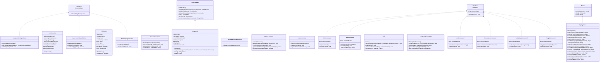

```mermaid
classDiagram
direction BT
class Command {
<<Interface>>
  + execute(String) void
   String commandName
}
class CompositeEntityValidator {
  + CompositeEntityValidator() 
  + addValidator(EntityValidator) CompositeEntityValidator
  + validate(EntityModel) void
}
class Configuration {
  + Configuration() 
  - String outputDirectory
  - boolean generateService
  - String targetPackage
  - boolean generateRepository
   boolean generateRepository
   boolean generateService
   String targetPackage
   String outputDirectory
}
class EntityBuilder {
  + EntityBuilder() 
  + primaryKeyProcessor(PrimaryKeyProcessor) EntityBuilder
  + addField(FieldModel) EntityBuilder
  + validator(CompositeEntityValidator) EntityBuilder
  + build() EntityModel
  + name(String) EntityBuilder
  + importProcessor(ImportProcessor) EntityBuilder
}
class EntityModel {
  + EntityModel() 
  + EntityModel(CompositeEntityValidator, ImportProcessor, PrimaryKeyProcessor) 
  - String name
  - Set~String~ imports
  - List~FieldModel~ fields
  + builder() EntityBuilder
  + validate() void
   Set~String~ imports
   String name
   String keyType
   List~FieldModel~ fields
}
class EntityValidator {
<<Interface>>
  + validate(EntityModel) void
}
class FieldModel {
  + FieldModel() 
  - String type
  - boolean isArray
  - String name
  - List~String~ modifiers
  + getIsArray() boolean
   String name
   String type
   boolean isArray
   List~String~ modifiers
   String capitalName
}
class GeneratedValueValidator {
  + GeneratedValueValidator() 
  + validate(EntityModel) void
  - isNumericType(String) boolean
}
class GeneratorService {
  + GeneratorService(Configuration) 
  - saveToFile(String, String, String) void
  + generate(List~EntityModel~) void
  ~ render(String, EntityModel) String
}
class HelpCommand {
  + HelpCommand() 
  + execute(String) void
   String commandName
}
class IllegalDSLInputException {
  + IllegalDSLInputException(String) 
}
class ImportProcessor {
  + ImportProcessor() 
  - processFieldType(FieldModel, Set~String~) void
  + processImports(EntityModel) void
  - processFieldModifiers(FieldModel, Set~String~) void
  - isValidationAnnotation(String) boolean
}
class InputController {
  + InputController(Consumer~String~) 
  + handleInput(String) void
  + registerCommand(Command) void
}
class ListCommand {
  + ListCommand(Configuration) 
  + execute(String) void
  - listCurrentSettings() String
   String commandName
}
class LoadCommand {
  + LoadCommand(Consumer~String~) 
  + execute(String) void
   String commandName
}
class Main {
  + Main() 
  - setCommands(InputController, Configuration, GeneratorService) void
  + main(String[]) void
  - processAndGenerate(String, GeneratorService) void
  - dslInput(String, Scanner) String
}
class PrimaryKeyProcessor {
  + PrimaryKeyProcessor() 
  - movePrimaryKeyToFirst(EntityModel, FieldModel) void
  - createDefaultPrimaryKey(EntityModel) void
  + processPrimaryKey(EntityModel) void
  - findPrimaryKey(EntityModel) FieldModel?
}
class PrimaryKeyValidator {
  + PrimaryKeyValidator() 
  + validate(EntityModel) void
}
class Result {
  - Result(FieldModel, String) 
  + field() FieldModel
  + type() String
}
class SetLocationCommand {
  + SetLocationCommand(Configuration) 
  + execute(String) void
   String commandName
}
class SetPackageCommand {
  + SetPackageCommand(Configuration) 
  + execute(String) void
   String commandName
}
class SpringVisitor {
  + SpringVisitor() 
  + visitProperty(PropertyContext) Object
  + visitListType(ListTypeContext) Object
  + visitPRIMARY(PRIMARYContext) Object
  + visitEMAIL(EMAILContext) Object
  + visitEntity(EntityContext) Object
  + visitSimpleType(SimpleTypeContext) Object
  - format(TerminalNode) String
  + visitOPTIONAL(OPTIONALContext) Object
  + visitLENGTH(LENGTHContext) Object
  + visitGENERATED(GENERATEDContext) Object
  + visitMIN_LENGTH(MIN_LENGTHContext) Object
  + visitMAX_LENGTH(MAX_LENGTHContext) Object
  + visitUNIQUE(UNIQUEContext) Object
  + visitModel(ModelContext) Object
  + visitREQUIRED(REQUIREDContext) Object
  + visitMIN(MINContext) Object
  + visitMAX(MAXContext) Object
}
class ToggleCommand {
  + ToggleCommand(Configuration) 
  + execute(String) void
   String commandName
}

CompositeEntityValidator  ..>  EntityValidator 
EntityModel  -->  EntityBuilder 
GeneratedValueValidator  ..>  EntityValidator 
HelpCommand  ..>  Command 
ListCommand  ..>  Command 
LoadCommand  ..>  Command 
PrimaryKeyValidator  ..>  EntityValidator 
SpringVisitor  -->  Result 
SetLocationCommand  ..>  Command 
SetPackageCommand  ..>  Command 
ToggleCommand  ..>  Command 

```
