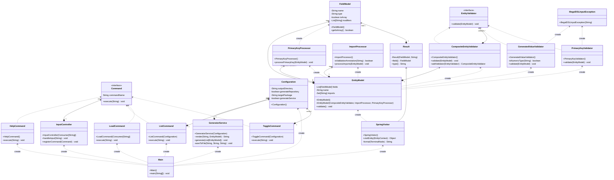

```mermaid
classDiagram
    direction BT
    class Command {
        <<interface>>
        +execute(String) void
        String commandName
    }
    class CompositeEntityValidator {
        +CompositeEntityValidator()
        +validate(EntityModel) void
        +addValidator(EntityValidator) CompositeEntityValidator
    }
    class Configuration {
        +Configuration()
        -String outputDirectory
        -boolean generateRepository
        -String targetPackage
        -boolean generateService
    }
    class EntityModel {
        +EntityModel()
        +EntityModel(CompositeEntityValidator, ImportProcessor, PrimaryKeyProcessor)
        -List[FieldModel] fields
        -String name
        -Set[String] imports
        +validate() void
    }
    class EntityValidator {
        <<interface>>
        +validate(EntityModel) void
    }
    class FieldModel {
        +FieldModel()
        -String name
        -String type
        -boolean isArray
        -List[String] modifiers
        +getIsArray() boolean
    }
    class GeneratedValueValidator {
        +GeneratedValueValidator()
        -isNumericType(String) boolean
        +validate(EntityModel) void
    }
    class GeneratorService {
        +GeneratorService(Configuration)
        ~render(String, EntityModel) String
        +generate(List[EntityModel]) void
        -saveToFile(String, String, String) void
    }
    class HelpCommand {
        +HelpCommand()
        +execute(String) void
    }
    class IllegalDSLInputException {
        +IllegalDSLInputException(String)
    }
    class ImportProcessor {
        +ImportProcessor()
        -isValidationAnnotation(String) boolean
        +processImports(EntityModel) void
    }
    class InputController {
        +InputController(Consumer[String])
        +handleInput(String) void
        +registerCommand(Command) void
    }
    class ListCommand {
        +ListCommand(Configuration)
        +execute(String) void
    }
    class LoadCommand {
        +LoadCommand(Consumer[String])
        +execute(String) void
    }
    class Main {
        +Main()
        +main(String[]) void
    }
    class PrimaryKeyProcessor {
        +PrimaryKeyProcessor()
        +processPrimaryKey(EntityModel) void
    }
    class PrimaryKeyValidator {
        +PrimaryKeyValidator()
        +validate(EntityModel) void
    }
    class Result {
        -Result(FieldModel, String)
        +field() FieldModel
        +type() String
    }
    class SpringVisitor {
        +SpringVisitor()
        +visitEntity(EntityContext) Object
        -format(TerminalNode) String
    }
    class ToggleCommand {
        +ToggleCommand(Configuration)
        +execute(String) void
    }

    CompositeEntityValidator ..> EntityValidator
    CompositeEntityValidator "1" *--> "validators *" EntityValidator
    EntityModel "1" *--> "validator 1" CompositeEntityValidator
    EntityModel ..> CompositeEntityValidator : create
    EntityModel "1" *--> "fields *" FieldModel
    EntityModel ..> GeneratedValueValidator : create
    EntityModel "1" *--> "importProcessor 1" ImportProcessor
    EntityModel ..> ImportProcessor : create
    EntityModel "1" *--> "primaryKeyProcessor 1" PrimaryKeyProcessor
    EntityModel ..> PrimaryKeyProcessor : create
    EntityModel ..> PrimaryKeyValidator : create
    GeneratedValueValidator ..> EntityValidator
    GeneratedValueValidator ..> IllegalDSLInputException : create
    GeneratorService "1" *--> "config 1" Configuration
    HelpCommand ..> Command
    InputController "1" *--> "commands *" Command
    ListCommand ..> Command
    ListCommand "1" *--> "config 1" Configuration
    LoadCommand ..> Command
    Main ..> Configuration : create
    Main ..> GeneratorService : create
    Main ..> HelpCommand : create
    Main ..> InputController : create
    Main ..> ListCommand : create
    Main ..> LoadCommand : create
    Main ..> SpringVisitor : create
    PrimaryKeyProcessor ..> FieldModel : create
    PrimaryKeyValidator ..> EntityValidator
    PrimaryKeyValidator ..> IllegalDSLInputException : create
    Result "1" *--> "field 1" FieldModel
    SpringVisitor --> Result
    SpringVisitor ..> EntityModel : create
    ToggleCommand ..> Command
    ToggleCommand "1" *--> "config 1" Configuration
```
